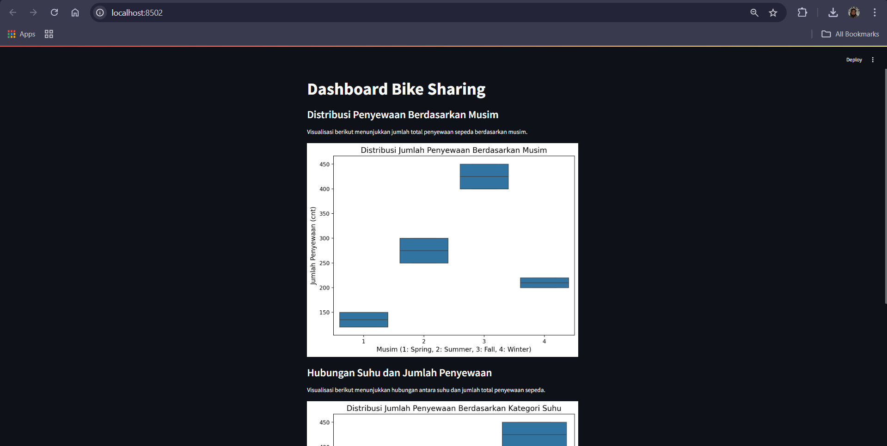

# Proyek Analisis Data Bike Sharing

Ini adalah aplikasi dashboard analisis data **Bike Sharing** yang dibuat menggunakan **Streamlit**.

## Deskripsi

Dashboard ini menyediakan dua analisis utama:

1. **Distribusi Penyewaan Berdasarkan Musim**
2. **Distribusi Penyewaan Berdasarkan Kategori Suhu**

## Tampilan Dashboard

Berikut adalah tampilan dari dashboard analisis data:



## Cara Menjalankan

1. Aktivasi virtual environment:
    ```bash
    .\venv\Scripts\activate
    ```
2. Instal dependensi:
    ```bash
    pip install -r requirements.txt
    ```
3. Jalankan aplikasi dengan Streamlit:
    ```bash
    streamlit run app.py
    ```

Aplikasi akan terbuka di browser pada alamat **http://localhost:8502**.
